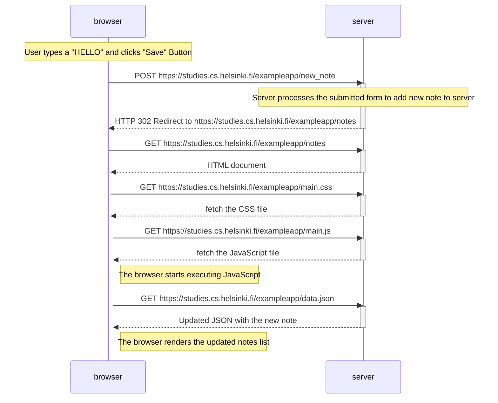

```mermaid
sequenceDiagram
    participant browser
    participant server

    Note over browser: User types a "HELLO" and clicks "Save" Button
    browser->>server: POST https://studies.cs.helsinki.fi/exampleapp/new_note
    activate server
    Note over server: Server processes the submitted form to add new note to server
    server-->>browser: HTTP 302 Redirect to https://studies.cs.helsinki.fi/exampleapp/notes
    deactivate server

    browser->>server: GET https://studies.cs.helsinki.fi/exampleapp/notes
    activate server
    server-->>+browser: HTML document
    deactivate server
    browser->>server: GET https://studies.cs.helsinki.fi/exampleapp/main.css
    activate server
    server-->>+browser: fetch the CSS file
    deactivate server

    browser->>server: GET https://studies.cs.helsinki.fi/exampleapp/main.js
    activate server
    server-->>browser: fetch the JavaScript file
    deactivate server

    Note right of browser: The browser starts executing JavaScript

    browser->>server: GET https://studies.cs.helsinki.fi/exampleapp/data.json
    activate server
    server-->>browser: Updated JSON with the new note
    deactivate server

    Note right of browser: The browser renders the updated notes list
```