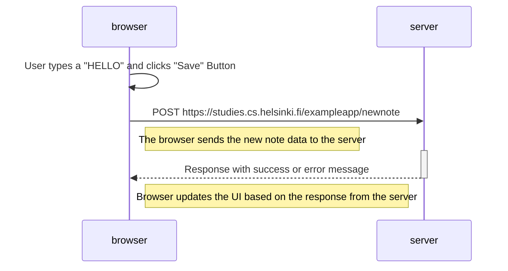

```mermaid
sequenceDiagram
    participant browser
    participant server

    browser->>browser: User types a "HELLO" and clicks "Save" Button
    browser->>server: POST https://studies.cs.helsinki.fi/exampleapp/newnote

    Note right of browser: The browser sends the new note data to the server
    activate server
    server-->>browser: Response with success or error message
    deactivate server

    Note right of browser: Browser updates the UI based on the response from the server

```